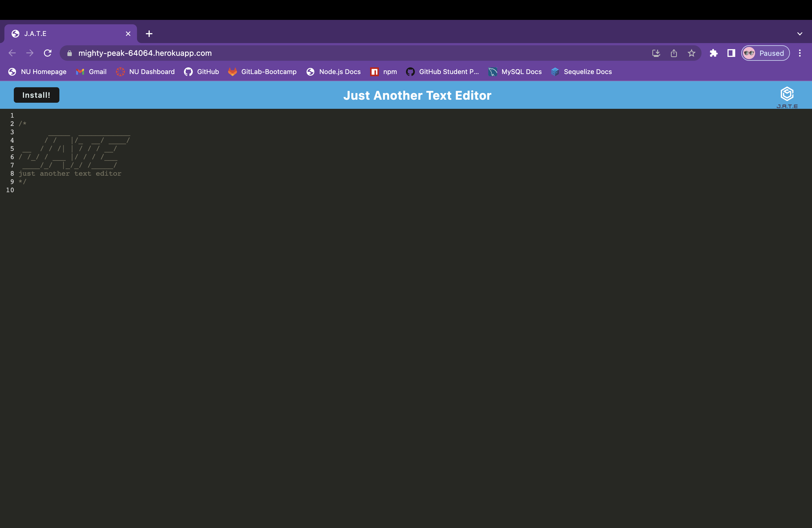
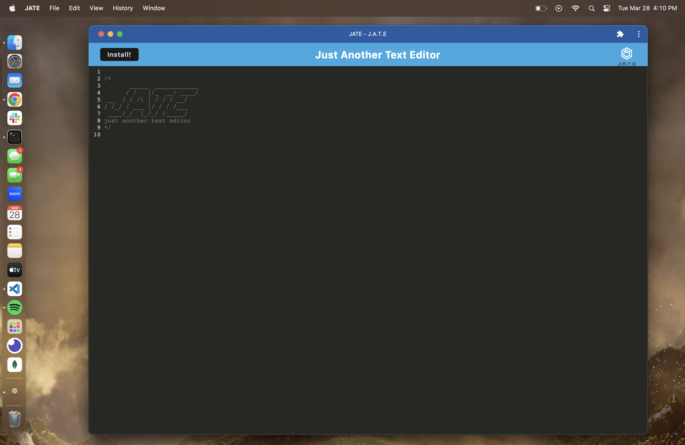

# Text-Editor-PWA
  

  ## Description
  
  J.A.T.E is both literally and figuratively "Just Another Text Editor." The web application allows users to to add any text they want in the text editor. After visiting the page once online, the application utilizes cache storage to allow for offline functionality. Users can update their text editor while offline and it the data will be persistent. JATE is also a progressive web application allowing users to download the application and run it locally on their device. By utilizing cache all data is persistent and if the user then re-opens the JATE live link they will find all changes they made locally to be displayed online.
  
  ## Table of Contents
    
  * [Installation](#installation)

  * [Usage](#usage)

  * [License](#license)

  * [Questions](#questions)
  
  ## Installation
  
  To use J.A.T.E navigate to this live link: [J.A.T.E Live Link](https://mighty-peak-64064.herokuapp.com/)

  You also have the ability to download the web application by clicking the 'Install' button in the top left side of the page.

  ## Usage
  
  JATE is extremely easy to use. By navigating the the link above you have the ability to save any notes you'd like in the text editor. All data is persistent: all text is automatically saved.

  After viewing the page once online, you can also view the page without internet connection. All information will be saved locally and will be synced once you navigate back to the webpage with internet connection whenever that might be.

  Starting webpage:

  

  By clicking on the install button you can even save the web application locally on your device so that you can run it anytime anywhere without needing to go online and connect to the internet. The same principle applies where all changes are automatically saved locally and if you ever go back to the web application url you will find all you local changes present.

  

  ## License

  This project is licensed under the MIT license.

  ## Questions

  If you have any questions about the repo, open an issue or contact me directly at ddsmm.managlia@gmail.com. You can find more of my work at [dmanaglia](https://www.github.com/dmanaglia).
  